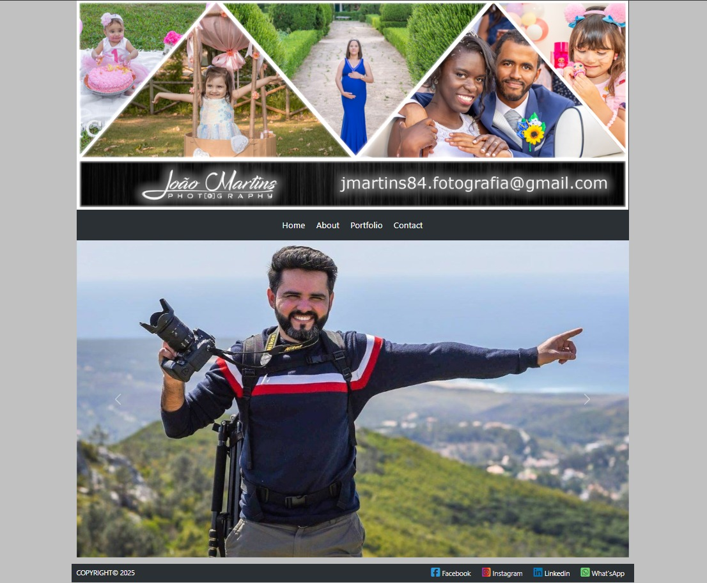
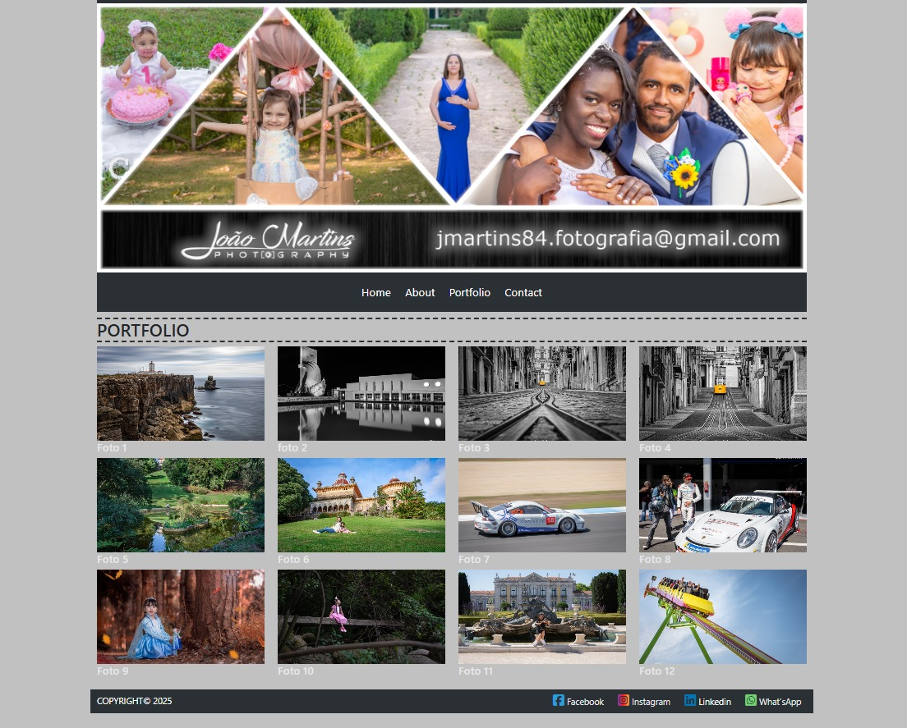
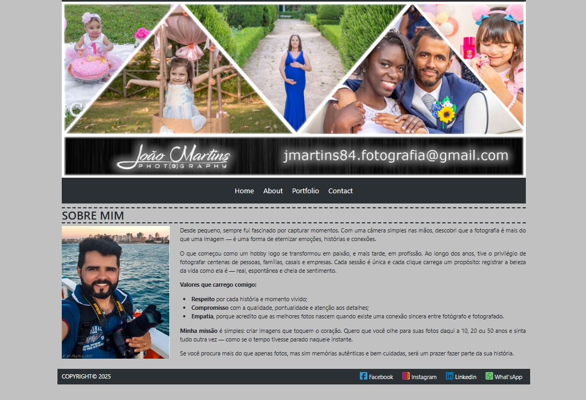
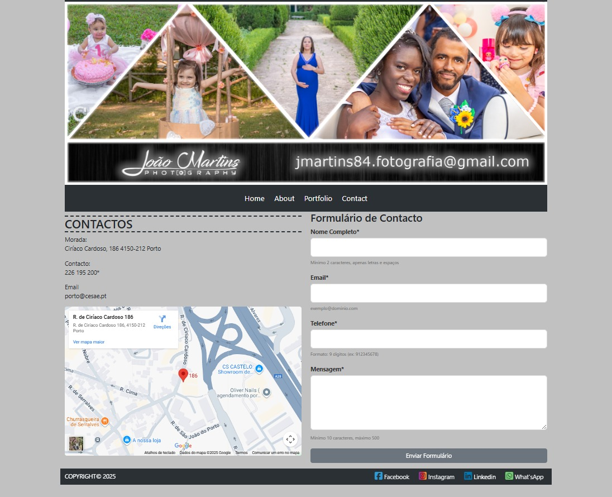
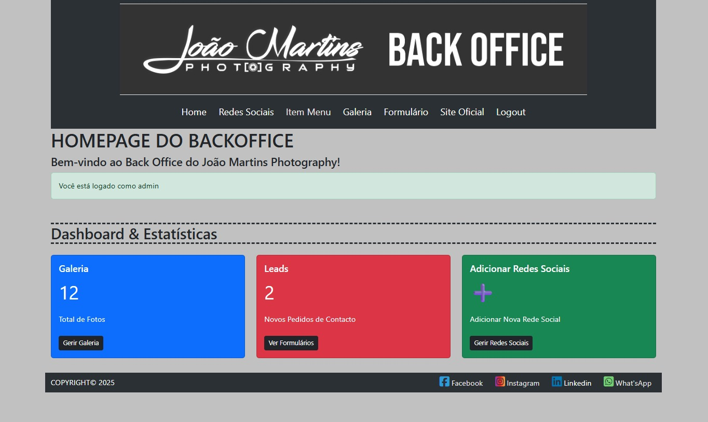
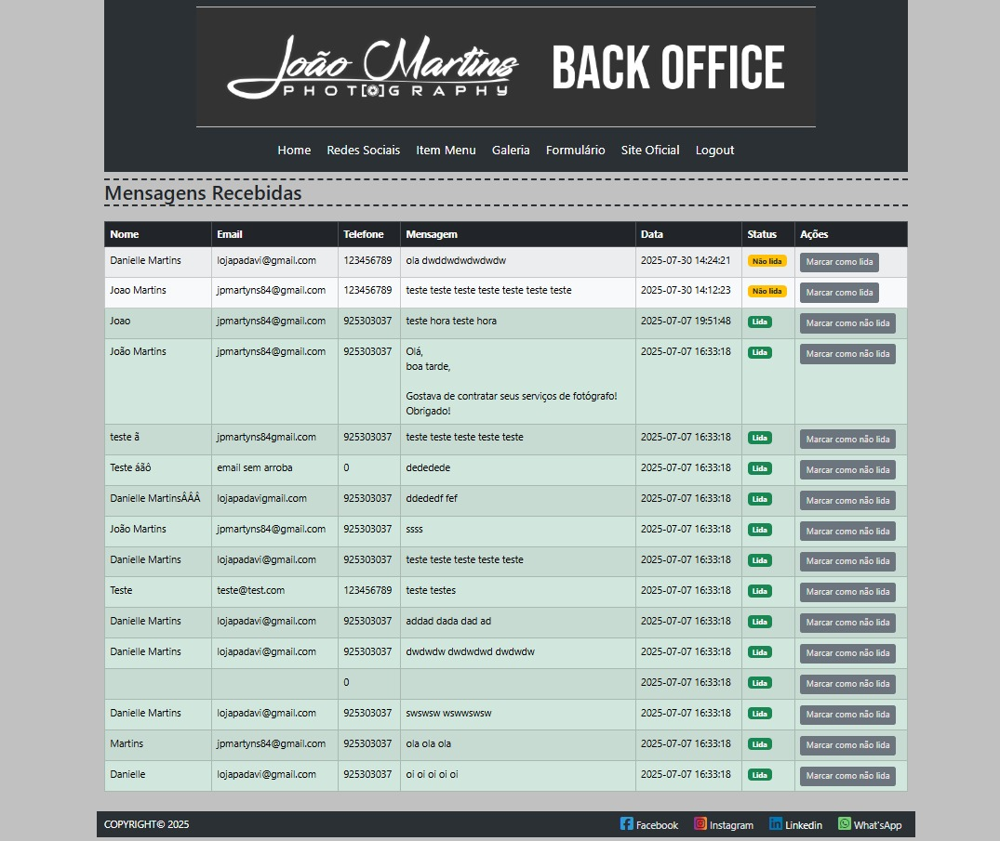
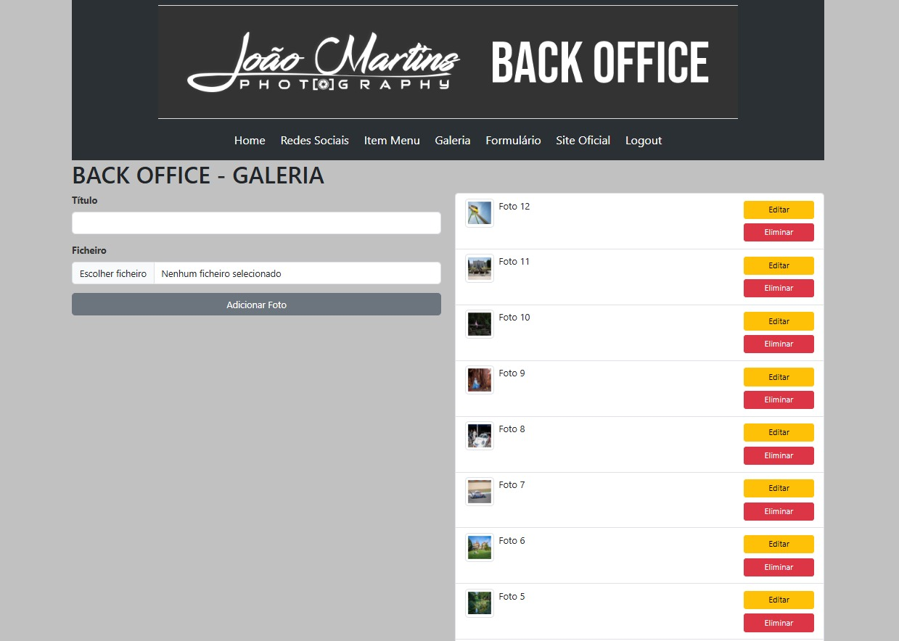

# 📸 Photographer Portfolio & Backoffice - Full-Stack PHP

## 📄 Description
This project is a functional, full-stack web application developed using **foundational (Vanilla) PHP and MySQL**. It serves as a professional portfolio website for a photographer, featuring a secure administrative area (Backoffice) for dynamic content management.

### Project Distinction: Real-World Content
The front-end of this application showcases **original, award-winning photography** by the developer, covering categories such as weddings, sports, and professional sessions. This ensures the project solves a genuine content management need and demonstrates a practical application of the Backoffice functionality.

### 🖼️ Front-end Images
Here's a overview of the public website for clients:





### 🖼️ Back-end Images
Here's a overview of the Dashboard with dynamic statistics and some more images of the back office:




## ✨ Core Features
* **User Authentication:** Secure login/logout system for the Backoffice administrator.
* **Session Management:** Controls access to administrative pages using PHP Sessions (`$_SESSION`).
* **Dynamic Portfolio:** Front-end displays content retrieved directly from the MySQL database.
* **CRUD Operations:** Full **C**reate, **R**ead, **U**pdate, and **D**elete functionality for managing portfolio categories, images, and other website content via the Backoffice.
* **Modular Design:** Reusable code structure for navigation (`menu.php`), headers, and footers using PHP `include()` statements.

## 🛠️ Tech Stack & Concepts
| Category | Technology | Concepts Demonstrated |
| :--- | :--- | :--- |
| **Back-end** | **Vanilla PHP (Procedural)** | Direct implementation of server-side logic and business rules. |
| **Database** | MySQL/MariaDB | Relational database management. **Managed via phpMyAdmin.** |
| **Authentication** | PHP Sessions (`$_SESSION`) | State management, user security, and authorization. |
| **Environment** | XAMPP / Apache | Local server setup and configuration. |
| **Front-end** | HTML5, CSS3, Vanilla JavaScript | Client-side behavior and responsive design. |

## 🚀 Setup and How to Run Locally

This project requires a local server environment (LAMP/XAMPP) to run the PHP code.

### Prerequisites
* **XAMPP** (or MAMP/WAMP) installed and running (Apache and MySQL services required).

### Steps
1.  **Move the Source Code:** Place the entire `website-backoffice-php` folder into your XAMPP `htdocs` directory (e.g., `C:\xampp\htdocs\website-backoffice-php`).
2.  **Start Services:** Ensure **Apache** and **MySQL** are running in your XAMPP Control Panel.
3.  **Database Setup:**
    * Open **phpMyAdmin** in your browser (`http://localhost/phpmyadmin/`).
    * Create a new database (e.g., `photodb`).
    * Import the necessary table structure (requires the project's SQL file).
4.  **Configure Connection:** Update the database connection credentials (username, password, database name) in the project's **`config.php`** file to match your local XAMPP setup.
5.  **Access the Application:** Open your browser and navigate to the local server path:

    ```
    http://localhost/website-backoffice-php/
    ```

    The front-end portfolio should load, and you can access the Backoffice via the designated URL (e.g., `/bo`).
